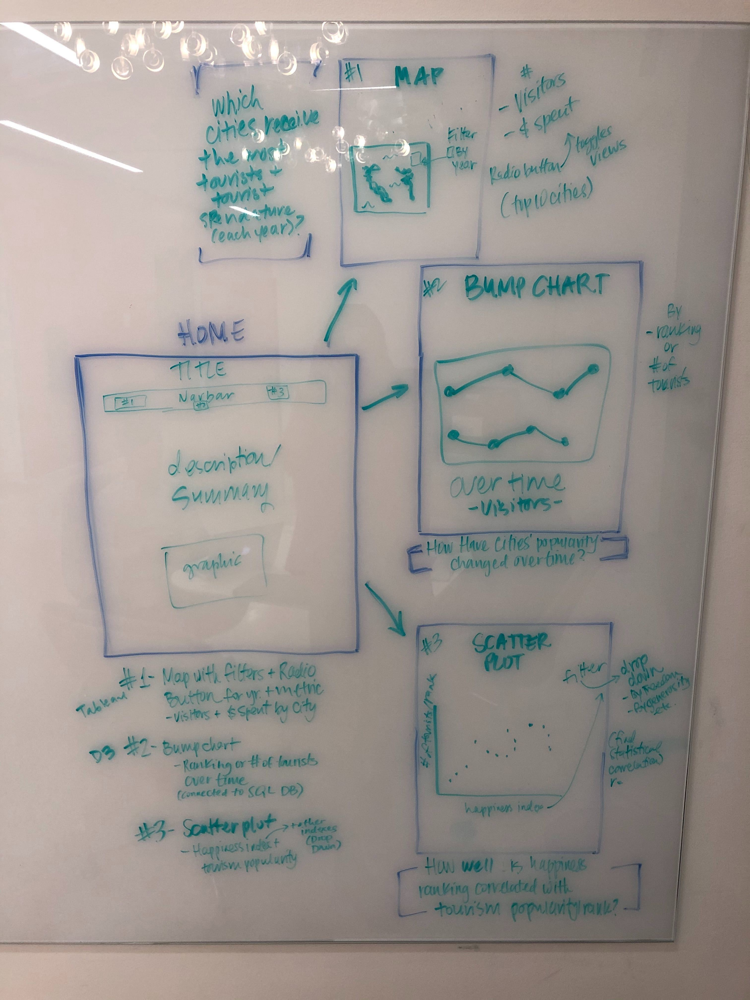

# Project Proposal
As a group of high-tech pirates, we will study the change in tourism in the most popular tourist destinations of the past decade (2011-2018). We will create maps that track amount of tourists and how much they are spending to try to discover patterns in their behavior over the years. We will also use the annual World Happiness Report to see if there are any qualities that may contribute to tourism for cities. Finally, we will rank the top 10 tourist destinations according to number of tourists, expenditures, and their density index (i.e. number of tourists vs. local population ratio). That way, we will determine the best targets to plunder and why!

Link to deployed project on Heroku: https://pirates-travel-index.herokuapp.com/

Link to Github repo: https://github.com/toestie/travel-index

# Group Members
* Chris Nguyen (Team Leader): [@c-l-nguyen](https://github.com/c-l-nguyen)
* Hayley Jellison (QA Tester): [@hayleyjellison](https://github.com/hayleyjellison)
* Hazel Despain (Tableau Visualization Analyst): [@hazeldespain](https://github.com/hazeldespain)
* Nathan Wong (Git Master): [@toestie](https://github.com/toestie)

# Data Sources

* https://github.com/toestie/pirates-travel-index/tree/master/data
* https://worldhappiness.report/
* https://data.worldbank.org
* https://newsroom.mastercard.com/wp-content/uploads/2019/09/GDCI-Global-Report-FINAL-1.pdf
* https://population.un.org/wup/Download/
   * https://population.un.org/wup/Download/Files/WUP2018-F12-Cities_Over_300K.xls

# Sketch of Final Design
<!-- Sketch of the final design -->

# Special Note
Please note that this project requires a URI string to be saved locally in the .bash_profile or as a config variable in Heroku as 'DATABASE_URL'.
