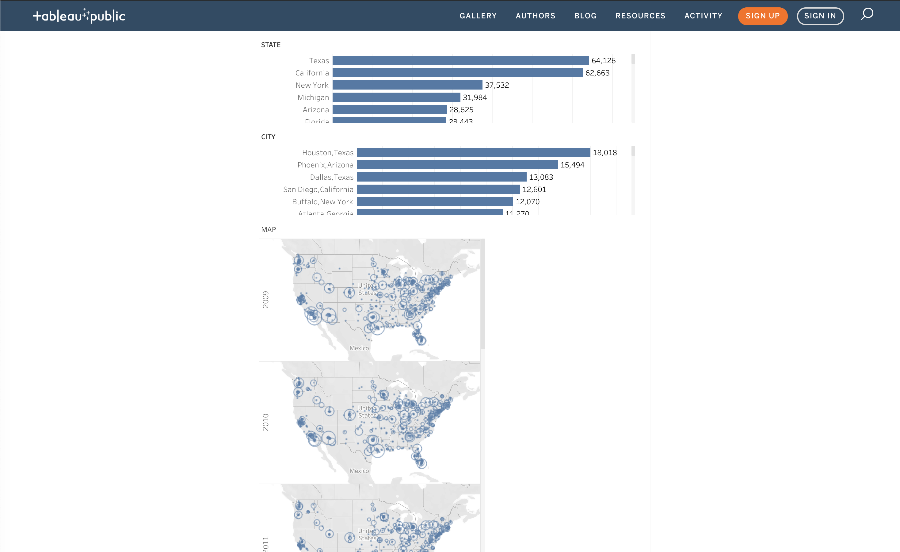

# Group Members
* Chris Nguyen (Team Leader) : [@c-l-nguyen](https://github.com/c-l-nguyen)
* Hayley Jellison : [@hayleyjellison](https://github.com/hayleyjellison)
* Hazel Despain : [@hazeldespain](https://github.com/hazeldespain)
* Nathan Wong (Git Master) : [@toestie](https://github.com/toestie)

# Project Proposal
The idea for this project is comparing tourist count versus local population count through the years 2011 - 2017. There is no one particular data set that has all the data that we are interested, so we will curate and compile data from multiple sources into one database that has everything we want by using ETL (extract, transform, load).

   <!-- - A link to your dataset(s) and a screenshot of the metadata if it exists. -->

## Inspiration
[Minimum Wage](https://public.tableau.com/en-us/gallery/us-workers-or-below-minimum-wage?gallery=votd)

[Refugee Admissions](https://public.tableau.com/profile/tc1115#!/vizhome/U_S_RefugeeAdmissionsProgramFY2009-2018/U_S_Refugees)

[Human Migration](https://public.tableau.com/en-us/gallery/flow-human-migration)

   <!-- - A sketch of the final design
   - A link to the primary GitHub repository you’ll be housing your work in -->